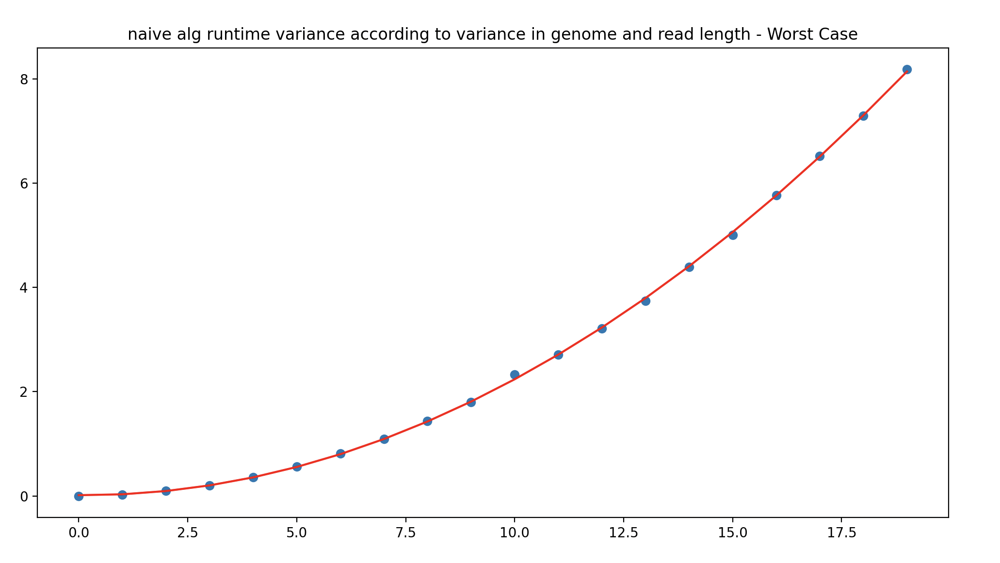
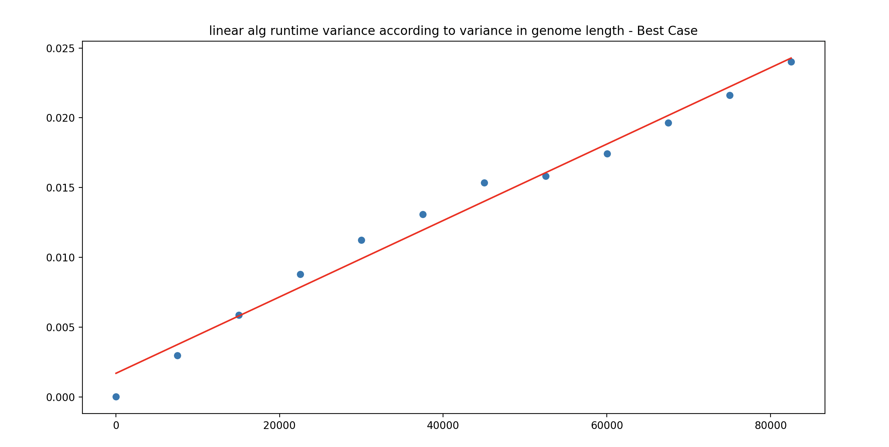

[](https://classroom.github.com/online_ide?assignment_repo_id=8412546&assignment_repo_type=AssignmentRepo)

# Basic exact pattern matching

This project is about exact pattern matching. You should implement the naive quadratic time algorithm and a linear time algorithm of your cheice, e.g. the border-array or the KMP-algorithm. The naive algorithm has the worst-case running time O(nm) and the other algorithms we have seen have worst-case running time O(n+m).

The algorithms should be implemented in two programs, `naive` and `lin`. Both programs should take two arguments (no more and no less): the first should be a Simple-FASTA file and the second a Simple-FASTQ file. The programs should output all matches in the Simple-SAM format to stdout (i.e., they should write to the terminal). Since we are only doing exact matching, the CIGAR strings in the output should consist of M’s only, since all the characters in the read will match the reference at the reported position.

For example, with this Simple-FASTA file

```
> chr1
mississippi
> chr2
mississippimississippi
```

and this Simple-FASTQ file

```
@read1
iss
@read2
mis
@read3
ssi
@read4
ssippi
```

your output should be

```
read1	chr1	2	3M	iss
read1	chr1	5	3M	iss
read1	chr2	2	3M	iss
read1	chr2	5	3M	iss
read1	chr2	13	3M	iss
read1	chr2	16	3M	iss
read2	chr1	1	3M	mis
read2	chr2	1	3M	mis
read2	chr2	12	3M	mis
read3	chr1	3	3M	ssi
read3	chr1	6	3M	ssi
read3	chr2	3	3M	ssi
read3	chr2	6	3M	ssi
read3	chr2	14	3M	ssi
read3	chr2	17	3M	ssi
read4	chr1	6	6M	ssippi
read4	chr2	6	6M	ssippi
read4	chr2	17	6M	ssippi
```

assuming you iterate over reads in an outer loop and FASTA records in an inner loop. If you order your loops differently, of course, the output will be different.

The project should be in groups of 2–3 students. It will not be graded.

## Part 1: parsers

Write parsers for Simple-FASTA and Simple-FASTQ if you have not done so already.

## Part 2: simulating data for evaluation

For testing the running time as functions of n and m, you should also write code for generating Simple-FASTA and Simple-FASTQ files (with appropriate properties for your tests).

## Part 2: mappers

Now write the tools for exact pattern matching. You can use the naive algorithm to test your linear time algorithm; the result of the two programs that you write should be identical after you sort the output.

```sh
> ./naive fasta.fa fastq.fq | sort > naive.sam
> ./lin fasta.fa fastq.fq | sort > lin.sam
> diff naive.sam lin.sam
```

You might not have to sort the output, if you run through reads

## Evaluation

Implement the two algorithms in two tools, `naive` and `lin`, that must be present at the root of the repository once they are built. The test setup checks that they give the correct output on selected data, but you should still carefully test them.

Once you have implemented the tools, fill out the report below.

## Report

### Insights you may have had while implementing and comparing the algorithms.

Implementing the naïve algorithm was straightforward, and so should have been the linear one, for which we chose KMP, but during the initial coding phase we confused `i` and `j` in some places, which caused a few headscratching moments.

### Problems encountered if any.

Our own testing revealed a flaw in constructing border arrays, meaning that in some cases, when two matches overlapped in the string by a single character, we would not recognize the second match. To add insult to injury, this was already the second, improved version of calculating the border arrays, after a way too simple approach on the first try.

### Experiments that verifies the correctness of your implementations.

In order to verify that both the naïve and the linear algorithm work as intended, we decided to generate a test with the solutions that tries both regular and extreme situations. The test tries the following cases:

- Short patterns and genomes (chains), with length going from 0 to 10 characters (selected randomly)
- Random chains
- Random chains, having a chance of repeating the previous character
- Random chains, having a chance of having a long sequence made up by a single character
- Random chains, where a character cannot appear consecutively two or more times.
- Fibonacci chains, made up by two different characters being concatenated following a Fibonacci distribution

All of these genomes (except the short ones) have a length between 2.000 and 10.000 characters, whilst the patters length varies between 3 and 200. Moreover, for each pair of chains the genome is adapted, forcing to include the pattern a random number of times between 0 and 10 (if the randomness have made up more). The inclusion of this patterns has a high probability of having four extreme situations:

- Pattern matching at the beginning of the genome
- Pattern matching at the end of the genoms
- Two pattern matchings next to each other
- Two pattern matchings overlapping one with each other

### Experiments validating the running time.

For both implementations of the naive and linear algorithm a polynomial regression was fitted to the runtime experiments results. For each graph only one variable (string being searched upon and pattern being searched for) length increased while the other remained the same, with the exception of the graphs where both increase at the same time. All the graphs were plotted two for each algorithm type, with each time the difference being worst or best case input.

Naive input choice for worst case was a pattern of only "a"s and the a string of only "a"s aswell, as this means that the algorithm will always have to check every character in the string against every character in the pattern.



For the naive with worst case input, when only increasing one of the variables the increase is linear, this is according to expectations of the algorithm having O(nm) with worst case inputs. And in the visualization with both increasing the polynomial regression is quadratic, which proves that for the worst case inputs and consequently all other inputs, that the naive algorithm implementation uses no more time than O(nm).

Naive input choice for best case was a pattern of only "a"s and the a string of only "b"s, as this means that the algorithm will always check every character in the string against only the first character in the pattern, making it O(n).


For the naive with best case input, when only increasing the string length the increase is linear, this is according to expectations of the algorithm having O(n) with best case inputs. When increasing only the pattern length there is a decrease in runtime, however the pattern length should not affect the runtime, this might be cause simply because of noisy data (due to background processes running in the laptop where the tests were run, memory allocation, etc.) and the sample of data not being big enough. And in the visualization with both increasing the polynomial regression is linear, which proves that for the best case inputs the naive algorithm implementation uses O(n).


Linear input choice for worst case was a pattern of only "a"s * n and a string with a reoccurring subtstring equal to "a"s * n-1 followed by a different character such as b, as this means that the algorithm will check every character, and when it finds the mismatch it will check that character against the pattern m times (against every character in the pattern).


For the naive with worst case input, when only increasing one of the variables the increase is linear, this is according to expectations of the algorithm having O(n+m) with worst case inputs, the only difference from naive being the slope of the regression being smaller. And in the visualization with both increasing the increase is also linear, with a bigger slope, which proves that for the worst case inputs and consequently all other inputs, that the naive algorithm implementation uses no more time than O(n+m).

Linear input choice for best case was the pattern "ababa" and a string "ababaabcabacacb", as this means that the algorithm will skip checking some characters in the string because of the use of the border array, so when it finds the mismatch it may skip characters in the string depending where the mismatch occurred.



For the naive with worst case input, when only increasing the read the regression is constant, this is due to outliers which might be caused by memory allocation that only happens for the first test. And in the visualization with both increasing the increase is also linear.
